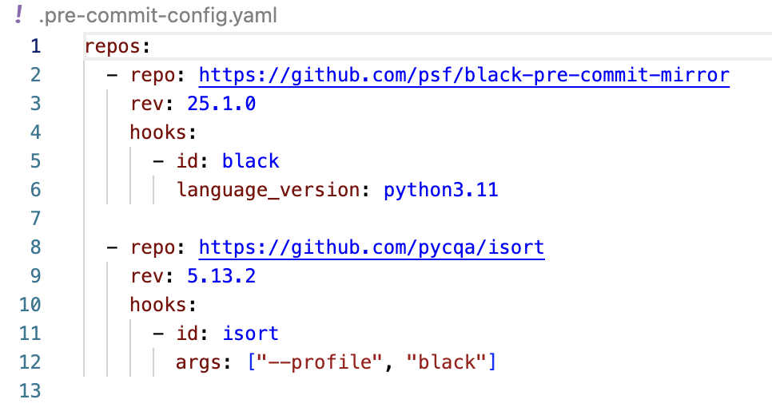
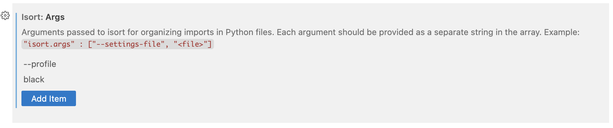

# Agent Flow

_As of 2025-06-21_

This repository is a work in progress. It will contain the code for a full-stack application.

## Description

A visual interface for building multi-agent AI workflows. Connect nodes, assign tools, and auto-generate runnable code.

## Details

The final application will include:

- A tab to create agent workflows: define agents by customizing base agents, assigning tools, and linking them together.
- A tab to run the created agent workflows.

Agent workflows are intended to be created and updated automatically via code generation logic.

# Runing the application

## Backend

### Simple run

To simply run the backend, use:

```bash
docker-compose up -d backend
```

Backend will be accessible at `BACKEND_PORT` (8080 by default)
MySQL will be accessible at `MYSQL_PORT_LOCAL` (13306 by default)

### To manually run

Python version: Python 3.13.3

1. Install the `backend/requirements.txt` in a local environment
2. Run the backend

```bash
gunicorn main:app --workers 1 --k uvicorn.workers.UvicornWorker --bind 0.0.0.0:8080
```

3. Access the backend at `127.0.0.1:8080/`

### To contribute

Make sure you are in backend/ folder

Create your local environment for this repo

```bash
python3.11 -m venv .venv
```

Activate it (bash/zsh)

```bash
source .venv/bin/activate
```

Install requirements

```bash
python -m pip install -r requirements.txt
```

### Formating

Make sure you are in root folder of the repository

Then make sure to install and activate the extensions on your IDE

- black formatter
- isort

Note that you should make sure to have the same args in your isort and black formatter settings as in the `.pre-commit-config.yaml` file



Then, once venv is activated, make sure to install pre-commit with

```bash
pre-commit install
```

And voilà. Now everytime you try to commit it will reformat the files if you are not respecting the formatting of blackformatter and isort. But as you have the extensions on, everything should be fine.
